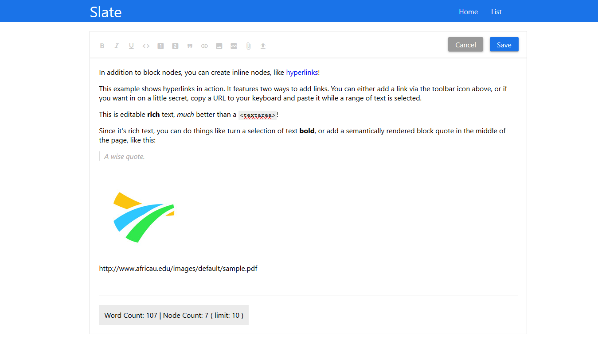
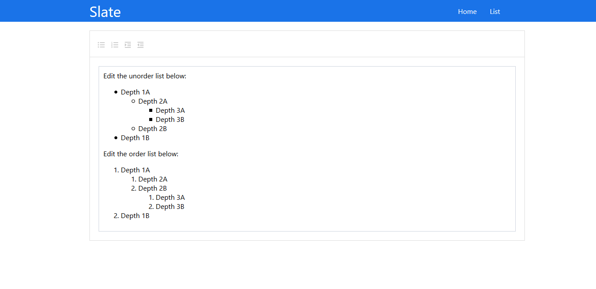

# Slate Rich Text Editor React
Building a customize able slate rich text editor using react. 


## Introduction
Slate is a completely customizable framework for building rich text editors.
Slate lets you build rich, intuitive editors like those in Medium, Dropbox Paper or Google Docs—which are becoming table stakes for applications on the web—without your codebase getting mired in complexity.
It can do this because all of its logic is implemented with a series of plugins, so you aren't ever constrained by what is or isn't in "core". You can think of it like a pluggable implementation of contenteditable built on top of React and Immutable. It was inspired by libraries like Draft.js, Prosemirror and Quill.


## Installation and use

```
$ git clone https://github.com/amirphp7/slate-react.git
```
```
$ cd slate-react
```
### Unix / Linux
```
$ yarn install
```
```
$ yarn start
```
### Windows
```
$ npm install
```
```
$ npm start
```


Runs the app in the development mode.<br>
**  http://localhost:3000 **

### Demo
** https://twisker-slate.herokuapp.com **

## Screenshots



## License
Checkers AI game is permissive software licensed under the [MIT license](https://opensource.org/licenses/MIT).
Frameworks and libraries has it own licensed
